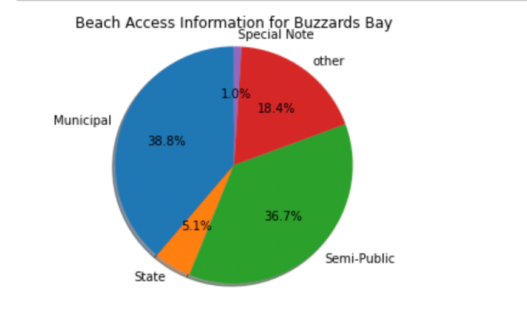
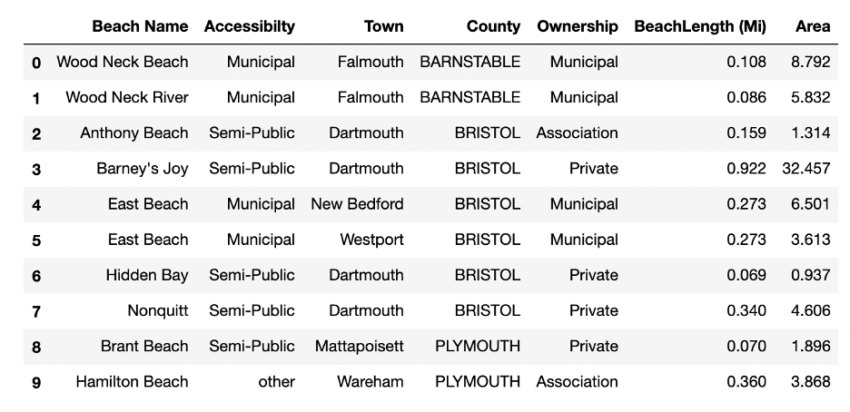

# WGBH Team 1

---

### Dataset Used

---

[Buzzards Bay Beach Map](https://buzzardsbay.org/enjoy-buzzards-bay/beach-information/)

[EPA Beach Map](https://watersgeo.epa.gov/beacon2/)

---

### Deliverable 2 by Nov 8

- [x] Collect and pre-process a secondary batch of data
- [x] Refine the preliminary analysis of the data performed in PD1
- [x] Answer one key question
- [x] Refine project scope and list of limitations with data and potential risks of achieving project goal
- [x] Submit a PR with the above report and modifications to original proposal

---

### Analysis of the secondary batch of data

1. From the above picture we can deduce the percentage of beaches in Buzzard's bay region that are accessible to public. There is a part of portion for which the data is not accurate, further analysis is being done to manually fetch data for the unknown.

2. Code written for deliverable1 is used to merge the data fetched from Buzzard's Bay website and the EPA site based on beach name. But the results yielded very low beach number since the names are not consistent. A different comprehensive approach based on the latitude and longitude position was tried t merge data but more than one matching data has been found.

3. A third approach of trying to fetch the beaches based on the town and county is being tried. Else manual intervention is required for the same.

4. Project limitations have been highlighted which require more of manual scrapping due to scattered data and waiting on the response from the client

**Below is the snap shot of the merged data**

