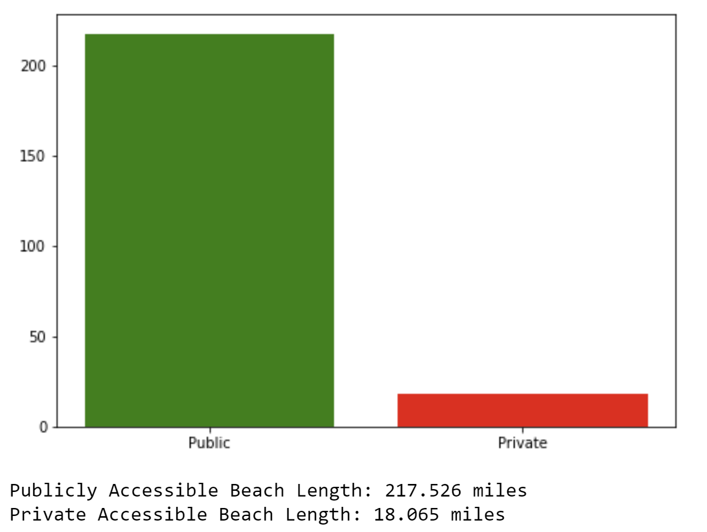

# Deliverable 1

## Contents

---

### **Read in and Merge datasets.ipynb**

This notebook demonstrates how we will be able to merge in-depth accessibility information into the EPA dataset which lacks detail in that sense.

### **Public Versus Private Beaches.ipynb**

Using exclusively data taken from the EPA BEACON 2.0 resource generator, an estimate was made of total public and private beach length in Massachusetts.

